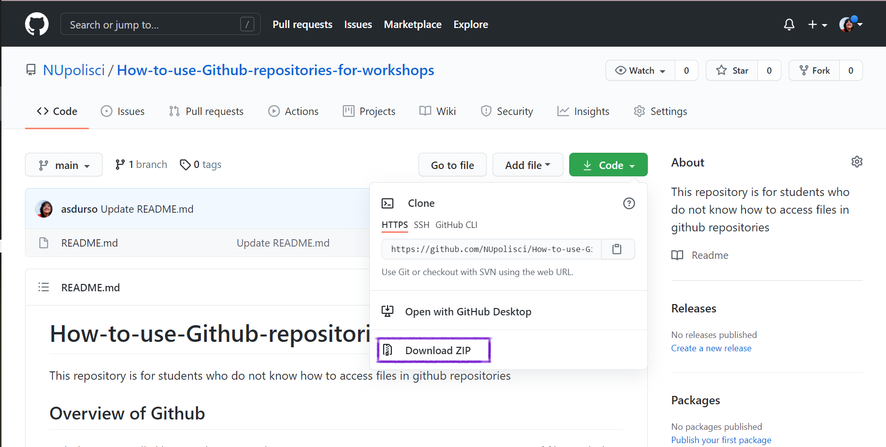
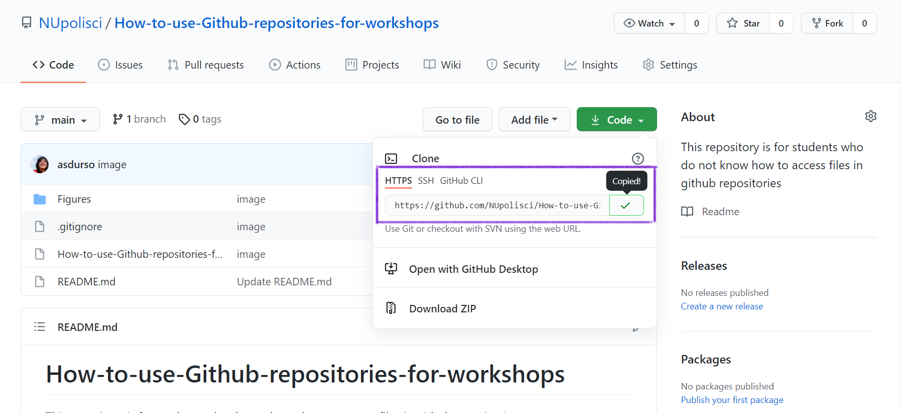

# How-to-use-Github-repositories-for-workshops
This repository is for students who do not know how to access files in github repositories

## Overview of Github
Github is essentially like 'Dropbox', 'Google Drive', 'Box', etc... It is a ways to manage versions of files, including R scripts, between collaborators and your past and furture selves. Rather than having each departmental workshop run out of different folders via 'Dropbox', 'Google Drive', 'Box', etc... we can put it all onto Github. This makes it simple for accessing the latest versions of all workshops, as well as previous workshops. 

## Simple: How to Download Github Repositories 

If you click on a repository, you will be lead to the repository's 'landing page'. For instance, this repository's 'landing page' is . Once here, click on the green button which says `Code`. From there, you can download the repository as a zip file. 

{width=500px}.

When you unzip the file, you can save it in any place on your computer that you prefer.

## Advanced: Connecting the Repo with Rstudio

You can consult . 

Basically, you must first you must make sure you have a Github account and that you have installed both Git and Rstudio onto your computer. Once you have created those accounts *and* downloaded both Rstudio and Git, you can continue in  through to Chapter 12. Once you have connected github with your computer, you can download the repository straight through to your laptop and Rstudio. 

To do so, go to the respository's landing page once again. In this case, it is . Once here, click on the green button which says `Code`. This time, instead of clicking `Download Zip`, you can copy the `HTTPS` (or `SSH`, but this requires you to set up SSH first). 

{width=500px}.
